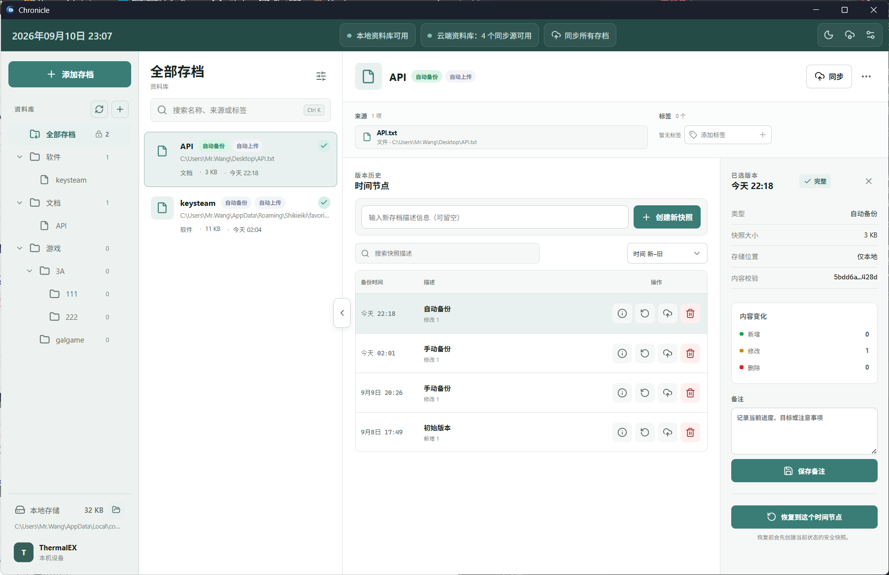
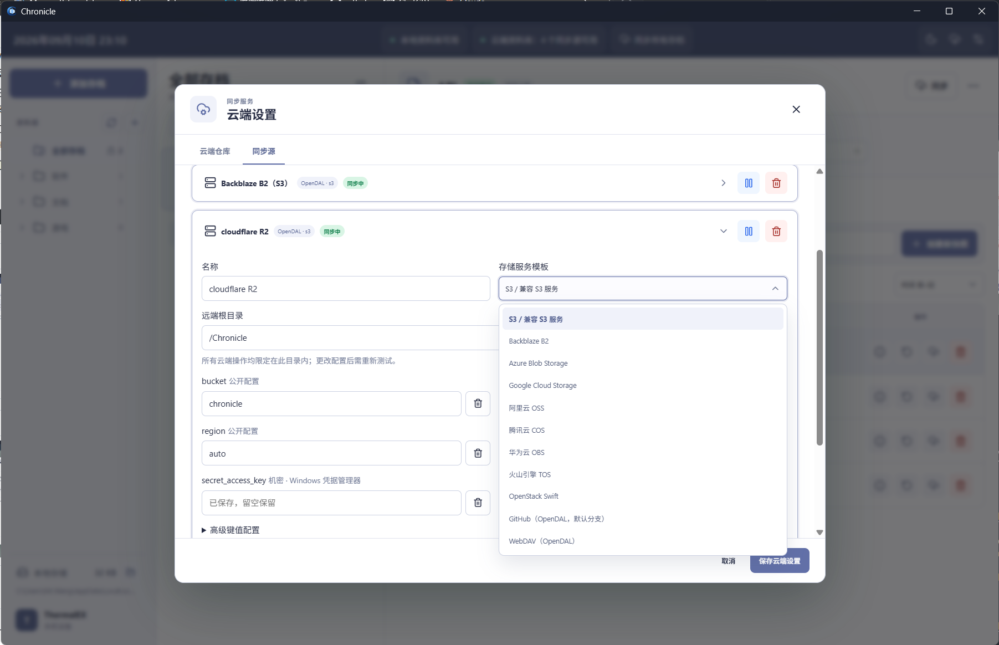
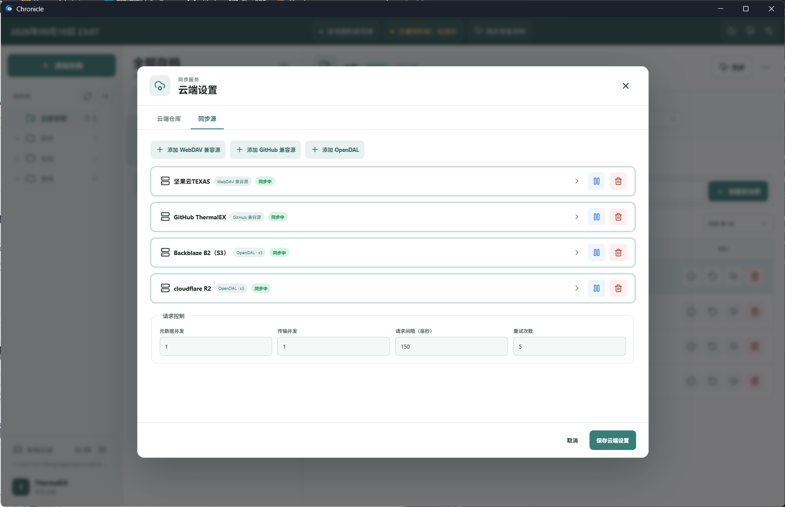
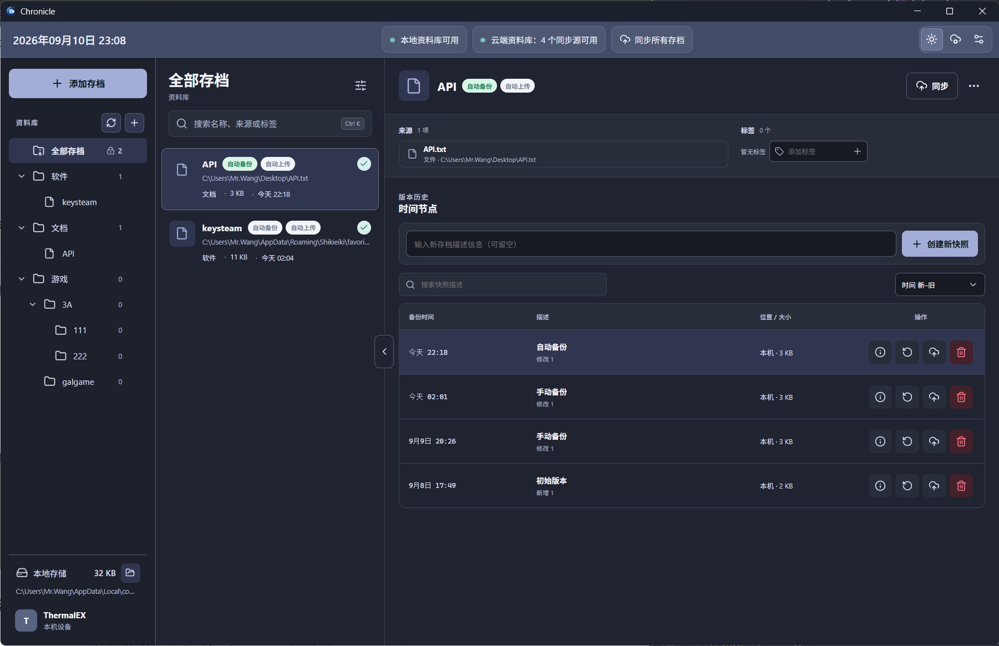

<p align="center">
  
</p>

<h1 align="center">Chronicle</h1>

<p align="center">
  
  
  
  
  
</p>

Chronicle 是一个面向游戏存档、软件配置和任意文件夹的桌面时间线备份工具。它以本地资料库为基础，把每次备份保存为可恢复的 `.7z` 快照，并可同步到 WebDAV、GitHub 或 OpenDAL 对象存储。

当前正式版本为 **1.1.0**。它提供多源云端同步与 OpenDAL 适配；新云端表单以当前程序为准。

## 功能

- 为单个文件或整个文件夹建立存档，按资料库分类管理。
- 创建不可变时间节点，比较变更、填写快照描述，并恢复到任意节点。
- 为每个时间节点保存备注；备注会写入资料库索引，云端同步后可在其他设备查看。
- 支持快照搜索、时间排序、打开本地压缩包、单节点同步及删除。
- 支持本地回收站、保留策略、错误记录与可复制的诊断信息。
- 保留 WebDAV 与 GitHub Repository 兼容同步源，新增 11 类 OpenDAL 服务模板及高级配置。
- 支持三方冲突处理、覆盖上传/下载；可保存并同时启用多个同步源，暂停某个来源不会影响其他来源。
- OpenDAL 机密字段只存 Windows 凭据管理器；新配置必须完成读写、列举、删除及临时对象清理测试后才能启用。
- 支持可录制的全局快捷键、日间/夜间模式和青绿、靛蓝、紫罗兰、琥珀、玫红、灰色主题。

## 界面截图

### 主工作区



### 云端设置



### 资料库管理



### 深色模式



## 技术栈

- Rust + Tauri 2：本地文件访问、压缩、同步与 Windows 系统集成。
- Vue 3 + TypeScript + Vite：桌面应用界面。
- JSON 索引 + `.7z` 快照：资料库元数据和版本文件。

## 本地开发

```bash
cd apps/desktop
npm install
npm run desktop:dev
```

常用验证命令：

```bash
cd apps/desktop
npm test
npm run typecheck
npm run build
cd src-tauri
cargo test
cargo clippy -- -D warnings
```

## Windows 发行版与资料库位置

- **安装版**：NSIS 安装向导支持选择安装位置；资料库始终保存到 `%LOCALAPPDATA%\com.thermalex.chronicle\Chronicle`，避免在 `Program Files` 等安装目录写入用户数据。
- **便携版**：解压后直接运行 `Chronicle.exe`。首次启动会在 EXE 同级创建 `Chronicle-data/` 作为新资料库；便携版不会读取、迁移或回退到 App Local Data。请保留 `Chronicle.exe`、`portable.marker` 与 `Chronicle-data/` 的同级关系。

## GitHub 同步权限

GitHub Repository 同步使用 Personal Access Token。已有仓库可使用限定目标仓库、具有 Contents 读写权限的 fine-grained token；程序中的令牌生成入口使用 classic token 的 `repo` 范围，供兼容同步和建仓使用。组织策略仍可能要求额外授权。令牌会写入 Windows 凭据管理器，设置文件只保存引用。

标准 GitHub 仓库模式会在 Chronicle 目录中维护：

```text
library.json
catalog.json
archives/<存档目录>/<时间>.7z
```

单个 `.7z` 快照超过 100 MB 时，GitHub 标准仓库 API 会拒绝上传；Chronicle 会在发起上传前提示该限制。

## 云端同步配置

v1.1.0 固定使用 Apache OpenDAL **0.59.1**，并保留旧 GitHub 与 WebDAV 兼容源。完整的逐服务商填写说明、字段对照、Cloudflare R2 与 Backblaze B2 示例，以及测试与安全注意事项见：[云端同步配置指南](docs/cloud-setup.md)。

## 更新日志

[查看完整更新日志](docs/changelog.md)
