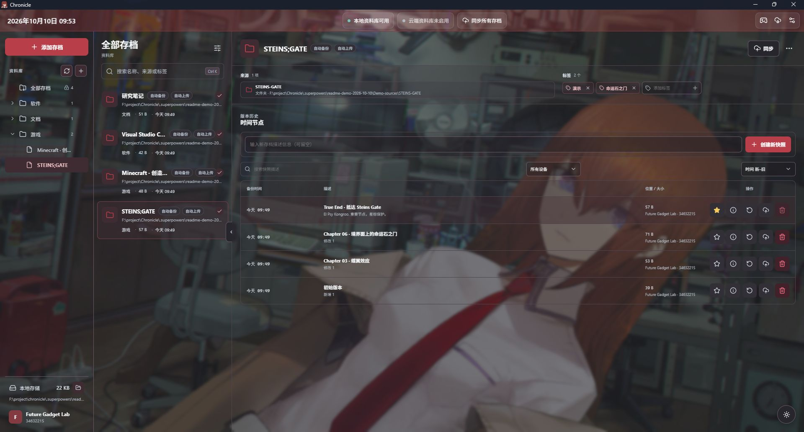
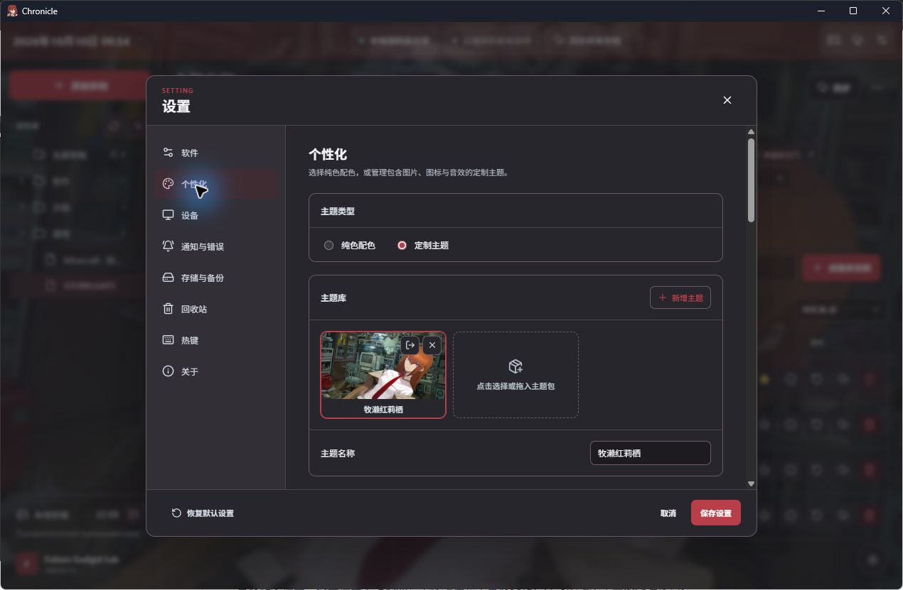
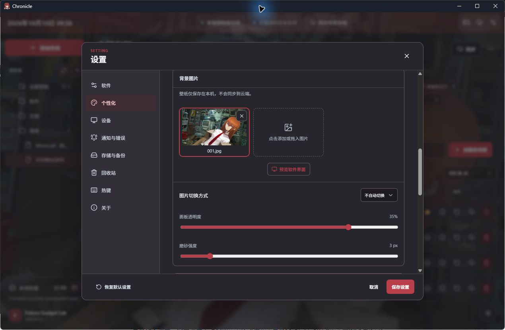
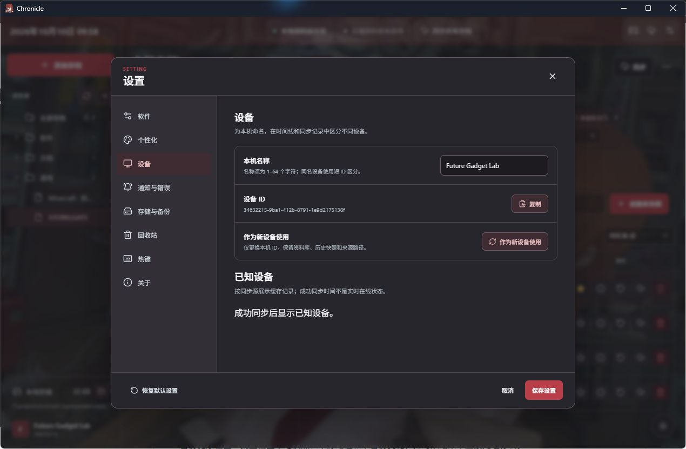
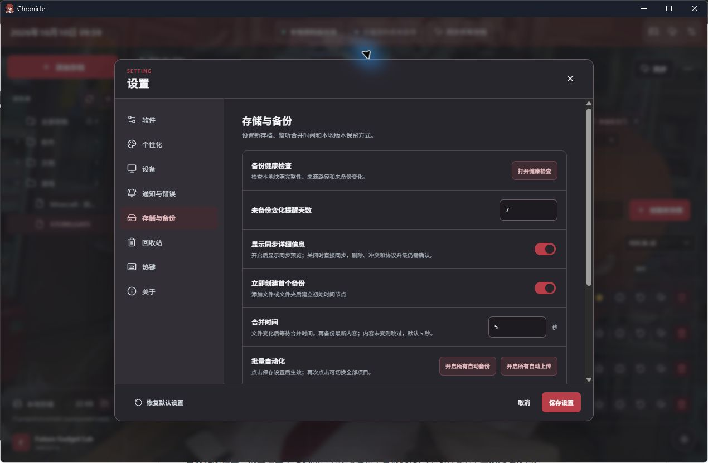

<p align="center">
  
</p>

<h1 align="center">Chronicle</h1>

<p align="center">
  
  
  
  
  
</p>

Chronicle 是面向游戏存档、软件配置和个人文件的桌面时间线备份工具。把重要变化保存为本地 `.7z` 快照，随时查看、恢复，也可以同步到多个云端，在不同设备之间接续使用。

[下载发行版](https://github.com/ThermalEX/Chronicle/releases) · [更新日志](docs/changelog.md) · [云端配置指南](docs/cloud-setup.md) · [主题包说明](docs/themes.md)

当前正式版为 **1.3.6**，包含定制主题库、多源并行同步和整体响应优化；各版本差异见更新日志。截图来自 Windows 桌面端，使用「牧濑红莉栖」主题和独立演示资料库。软件不附带默认壁纸或角色主题包，主题市场和视频主题尚未实现。

示例主题可单独下载：[牧濑红莉栖](https://github.com/ThermalEX/Chronicle/releases/download/v1.3.6/Makise-Kurisu.zip) · [粉漫少女](https://github.com/ThermalEX/Chronicle/releases/download/v1.3.6/Pink-Anime-Girl.zip)。无需解压，在「设置 → 个性化 → 定制主题」导入 ZIP，预览后保存；主题名取自 ZIP 文件名，可在导入前改为中文名称。素材版权和来源见 [主题包说明](docs/themes.md)。



## 能做什么

### 时间线备份与资料库

- 一个存档可包含多个文件、文件夹或 Windows 注册表子键；支持嵌套分类、标签、搜索和排序。
- 从资源管理器拖入文件或文件夹，核对来源并选择分类后创建存档；拖入本身不会立即备份。已创建的存档也可拖动到其他分类。
- 创建独立的 `.7z` 时间节点，显示新增、修改、删除数量；支持备注、快照搜索、打开压缩包和单节点同步。
- 恢复前先创建安全快照，再恢复选定版本；星标锁定重要节点，锁定节点不占普通保留数量，也不会被自动清理。
- 可设置 `*.tmp`、`cache/` 等排除规则；排除项不进入新快照、不触发监听备份，恢复时保留受规则保护的本机文件。
- 提供存档回收站、独立快照回收区、保留策略、错误记录和可复制诊断信息。

### 自动备份与健康检查

- 按存档开启文件变化监听，等待写入稳定后自动备份，合并等待时间可调；可将新快照自动上传到全部未暂停的同步源。
- 支持绑定实际游戏 `.exe`，或从运行中程序选择；同一程序的所有实例退出后再备份。静默时间默认 5 秒，可设置 1–300 秒，内容未变化时跳过。
- 关闭主窗口可留在托盘，继续监听与备份；支持随系统启动、通知和可录制的全局快捷键。
- 本地健康检查核对快照 SHA-256、来源可访问性和未备份变化；支持进度、取消及过期提醒，默认 7 天，可设置 1–365 天。

Chronicle 需要保持运行或留在托盘；不会补记关闭期间的游戏退出。健康检查不访问云端、不自动修复文件，注册表只检查可访问性；哈希一致不等于已经验证恢复。备份也不提供系统级原子快照保证。

### 多源同步与删除保护

- 支持 WebDAV、GitHub Repository，以及 OpenDAL 的 S3、Backblaze B2、Azure Blob、GCS、OSS、COS、OBS、TOS、Swift、GitHub 和 WebDAV 模板。可同时启用多个源，也可单独暂停。
- 手动同步当前存档、全部存档或单节点；预览显示上传、下载、备注与锁定修订、回收、冲突和无需处理项。
- 预览按「云盘 → 存档」两层折叠，默认全部收起；红色数字标注改动，各云盘单独显示进度，操作和同步记录均完成后显示绿色勾。
- 全部有已选操作的同步源并行执行；一个源失败不影响其他源。无已选操作的源直接跳过，不再隐藏执行一遍；需要重建索引或更新设备名称时，会单独显示可选维护项。
- 无冲突操作和回收项默认勾选，可一键取消／重新选择全部回收项；执行含回收的计划前，再单独确认回收内容。冲突不能直接执行。
- 执行前核对计划相关状态，外部修改或锁定冲突要求重新预览；取消只停止后续操作，不撤销已提交操作，失败后可重新预览重试。

「设置 → 存储与备份 → 显示同步详细信息」默认关闭，普通同步直接执行；开启后显示完整预览。回收、冲突和首次协议升级即使关闭详细信息也会要求核对。

删除依赖明确的操作记录，不把文件丢失、扫描失败或权限错误推断为删除。手动删除及保留策略清理先将快照放入本机回收区；确认同步后，云端从活动时间线隐藏节点，仍保留文件和恢复信息。恢复生成新节点 ID，不撤销旧 ID 的删除记录，也不会自动将内容恢复到游戏目录。永久清理需再次确认，逐源显示结果，并长期保留防复活记录。

自动上传只处理新增快照，不下载、不传播待确认回收，也不重新上传已知删除节点；备注和星标修订通过手动同步处理。整个存档或分类的删除不传播。

启用新同步协议前，必须升级连接同一云端资料库的全部设备，禁止旧客户端混用。首次启用验证并登记已有快照，不追溯推断历史删除。永久清理无法恢复文件，请确认所有设备已同步且不再需要恢复；从未上传、已永久清理本机文件的节点可能无法补齐云端回收副本。

### 多设备识别

- 编辑本机名称、复制稳定设备 UUID，查看各同步源的已知设备与最后成功同步时间；同名设备通过短 ID 区分。
- 左下角显示真实设备名称，快照时间线可按设备筛选；旧节点无来源信息时显示「未知设备」，不猜测归属。
- 云端下载不覆盖本机身份和来源绑定；新下载的存档需在当前设备重新定位来源，不自动映射跨设备路径。
- 复制资料库后可选择「作为新设备使用」生成新 UUID，保留历史快照、删除记录和本机路径绑定；不采集硬件指纹，不静默更换身份。

最后同步时间是历史记录，不表示设备实时在线。

### 个性化与主题包

在「设置 → 个性化」选择纯色配色或定制主题，二者互斥；纯色模式不显示主题库。

- 提供青绿、靛蓝、紫罗兰、琥珀、玫红、灰色预设；定制主题还支持自选强调色及十六进制颜色值。支持日间、夜间和跟随系统，右下角可快速切换明暗。
- 主题库支持新增、命名、切换、编辑；点击虚线卡片或拖入 ZIP 导入。每张主题卡片右上角可删除或单独导出，不必先切换当前主题。
- 一份主题 ZIP 包含颜色、明暗、图片、图标、音效及播放配置，无需手动解压。导入时勾选应用哪些内容；未勾选的资源不载入，颜色使用默认配置。
- ZIP 文件名作为主题名称；导出采用编辑中的主题，选择保存位置生成同名 ZIP，不额外在 JSON 中保存名称，也不自动保存设置。
- 背景支持图片缩略图列表、点击／拖入添加、逐张删除；可固定一张、自定义 1–86400 秒间隔随机轮播，或每次完整启动随机一张。图片预加载后渐隐切换，尊重减少动态效果设置。
- 整窗壁纸与半透明面板，透明度和磨砂强度可调；居中的预览按钮直接展示实际软件界面，而非只显示图片。
- 自定义图标用于关于页、运行中的窗口、任务栏及托盘；不替换安装包、EXE 或已有快捷方式的固定图标。
- 可导入声音包到主题，定制连接、断开、连接失败、通知和默认响声五种事件，支持开关、音量及试听；不更改 Windows 系统音效。

统一点击底部「保存设置」生效，关闭未保存的设置会提示保存或放弃。个性化资源仅存本机，不随云端同步；便携版的外观保存在自身 `Chronicle-data` 中。主题包不含设备身份、云端凭据或游戏存档。格式和限制见 [主题包说明](docs/themes.md)。

### 游戏存档识别

顶部游戏手柄入口包含两个分页：

- Steam：识别多个 Steam 库，按本机账号昵称分组；使用 Ludusavi 路径库匹配文件、文件夹、注册表和 userdata。首次需要联网下载路径库，之后可使用缓存；扫描结果本地保存，支持手动刷新及更新路径库。
- Galgame（Beta）：选择合集文件夹，递归识别 Kirikiri、Ren’Py、RPG Maker、Wolf RPG 等引擎，以及常见存档目录；检查游戏内和 AppData、文档、Saved Games 中已有位置。离线扫描，可取消，不执行游戏程序或脚本，跳过链接和云端占位文件。

核对并勾选实际来源后批量添加，可选择立即创建第一份快照；已管理的来源跳过，自动备份及自动上传默认关闭。规则不保证覆盖所有游戏，特殊位置可手动添加；未生成存档时可先运行游戏并保存一次。

Steam 数据来自 [Ludusavi Manifest](https://github.com/mtkennerly/ludusavi-manifest)，主要参考 [PCGamingWiki](https://www.pcgamingwiki.com/)。

### 语言、教程与更新

- 简体中文与 English 界面，首次语言选择和分步教程；教程可跳过或从关于页重新开始。
- 设置内语言支持即时预览，统一保存；放弃修改恢复已保存语言。用户自己的名称、路径和第三方原始错误保留原文。
- 正式版／测试版更新频道、启动检查和手动检查，查看更新说明、打开下载页，或下载 Windows 安装包后启动。
- 下载和 SHA-256 校验分阶段显示进度与加载动画；未知总大小时显示不定进度。可使用发行页的 `SHA256SUMS.txt` 手动核对下载文件。

## 界面截图

以下均为本次发布前拍摄的 Windows 实机截图，使用「牧濑红莉栖」主题；存档、设备名和来源为演示数据，未连接真实云端。

### 主题库

主题与纯色模式分开，支持命名、切换，以及卡片上的导出、删除。



### 壁纸与实际界面预览

图片列表、播放方式、半透明面板和磨砂强度独立调整。



### 设备身份

本机名称与稳定 UUID 独立于云端配置。



### 存储与备份

同步详细信息、备份健康检查与保留策略集中管理。



截图中的角色、壁纸和定制图标仅用于主题效果展示，相关素材版权归原权利人，不属于本项目 GPL 授权范围，也不随软件默认分发。壁纸取自 STEINS;GATE RE:BOOT 官方介绍图，素材说明见 [主题包说明](docs/themes.md)。

## 下载与开始使用

从 [GitHub Releases](https://github.com/ThermalEX/Chronicle/releases) 选择 Windows 安装版或便携版，测试版本标记为 Pre-release。Windows 构建未签名。

1. 创建存档，选择文件、文件夹或注册表来源，并设置分类。
2. 创建第一份快照，按需开启自动备份；重要节点可加星锁定。
3. 需要多设备时配置同步源，通过能力测试，确认同库设备升级后手动同步。
4. 喜欢定制外观时，在个性化页导入自己的主题 ZIP，预览后保存。

安装版资料库位于 `%LOCALAPPDATA%\com.thermalex.chronicle\Chronicle`，不写入 `Program Files`。便携版在 EXE 同级使用 `Chronicle-data/`，请保留 EXE、`portable.marker` 和资料库的同级关系。

旧版 1.3.5 Beta 存在本机外观隔离问题，可能读取安装版／开发版此前选用的图片；安装包本身不包含壁纸。1.3.6 已隔离便携版外观资源，具体版本差异见 [更新日志](docs/changelog.md)。

## 云端配置与注意事项

完整字段对照、Cloudflare R2、Backblaze B2 等示例见 [云端同步配置指南](docs/cloud-setup.md)。OpenDAL 源启用前验证读写、列举、删除及临时对象清理能力；机密字段存 Windows 凭据管理器，配置文件只保存引用。

GitHub Repository 同步使用 Personal Access Token：已有仓库可使用限定目标仓库、具有 Contents 读写权限的 fine-grained token；兼容建仓入口使用 classic token 的 `repo` 范围。组织策略可能要求额外授权。单个 `.7z` 快照超过 100 MB 时，标准 GitHub 仓库 API 会拒绝上传。

云端保存资料库展示索引、快照和 `sync-v2/operations/` 追加记录；展示索引不是删除判定的唯一依据。覆盖上传／下载也不能绕过删除保护。同步不会自动恢复文件到游戏目录。

Windows 注册表来源支持 `HKCU`、`HKLM` 的 64 位视图；恢复可选合并或覆盖，覆盖需额外确认，两者均先创建安全快照。不自动提权，暂不监听注册表变化。

## 本地开发

技术栈：Rust + Tauri 2，Vue 3 + TypeScript + Vite，JSON 索引与 `.7z` 快照。桌面功能以 Windows 为主要支持平台。

准备发布时请核对 [发布注意事项](docs/release-checklist.md)，Beta 安装包与便携包的文件名必须包含 `beta`。

在项目根目录执行（需要 Node.js、Rust 及 Tauri Windows 构建环境）：

```bash
npm --prefix apps/desktop install
npm run desktop:dev
```

开发服务器使用 `127.0.0.1:1420`，启动前请确保没有另一个实例占用该端口。

常用验证命令：

```bash
npm --prefix apps/desktop test
npm --prefix apps/desktop run typecheck
npm --prefix apps/desktop run build
cargo test --workspace --locked
cargo check --workspace --locked
cargo test --manifest-path apps/desktop/src-tauri/Cargo.toml --locked
cargo check --manifest-path apps/desktop/src-tauri/Cargo.toml --locked
```

## 反馈与许可

报告问题请附版本号、操作步骤及「设置 → 通知与错误」中的诊断记录；请勿提交令牌、密码或真实游戏存档。待补充信息的反馈见 [待办记录](docs/pending-feedback.md)。

This project is licensed under the GNU General Public License v3.0. See [LICENSE](LICENSE).
