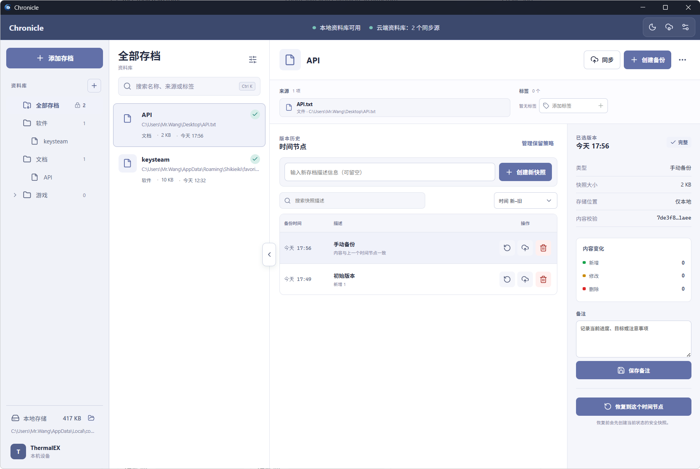
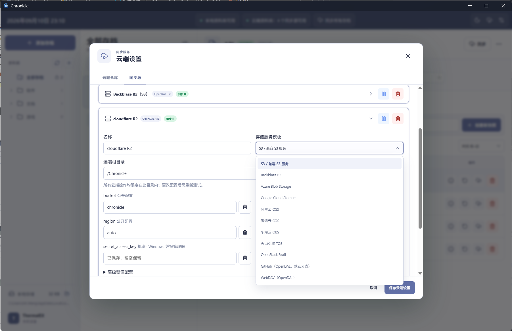
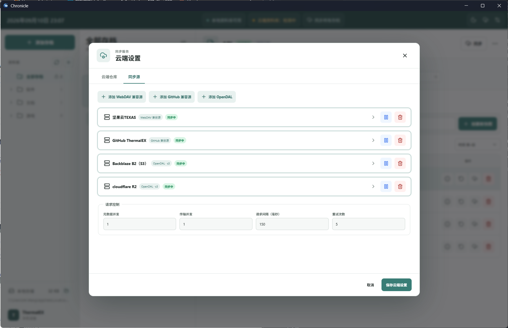
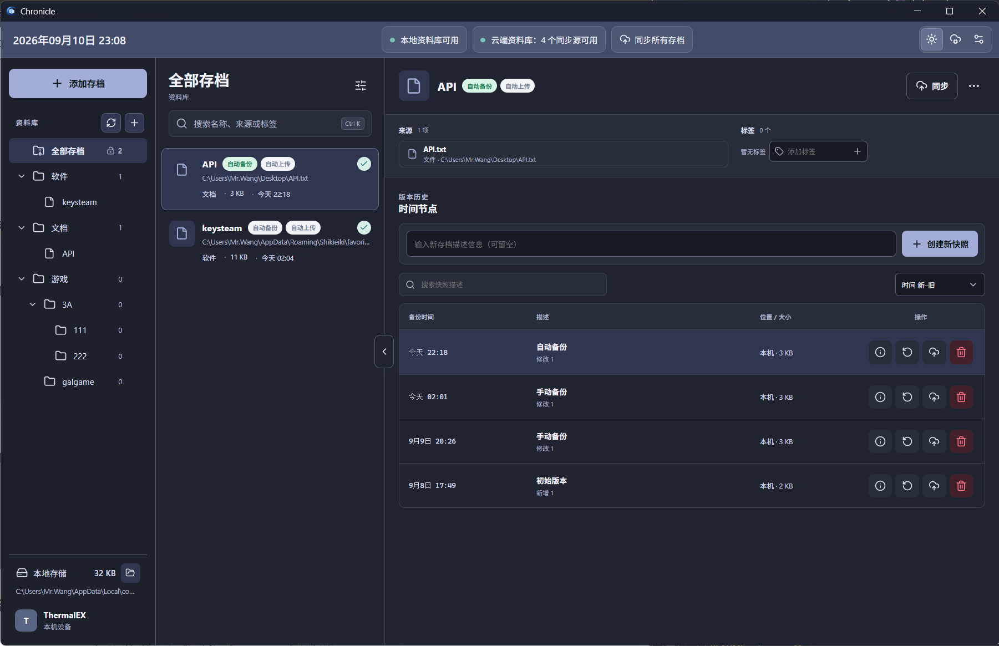

<p align="center">
  
</p>

<h1 align="center">Chronicle</h1>

<p align="center">
  
  
  
  
  
</p>

Chronicle 是一个面向游戏存档、软件配置和任意文件夹的桌面时间线备份工具。它以本地资料库为基础，把每次备份保存为可恢复的 `.7z` 快照，并可同步到 WebDAV、GitHub 或 OpenDAL 对象存储。

当前正式版为 **1.3.4**，新增多设备识别、同步预览及快照删除保护。支持 Steam 存档识别、Galgame 存档扫描（Beta）、简体中文与英语界面、自动备份、自动上传、托盘后台运行与多源云端同步。

## 功能

- 扫描 Steam 多个游戏库的存档来源，按账号昵称分组，勾选后批量添加；扫描结果本地缓存，可选择手动刷新。
- Galgame 存档扫描（Beta）：选择合集文件夹，递归识别嵌套目录中的游戏，检查游戏内及常见 Windows 用户目录中的已有存档，核对后批量添加。
- 支持简体中文与英语，欢迎页和设置中均可切换，立即生效并保存选择。
- 首次使用提供语言选择与动态问候、主题预览及分步教程，涵盖创建存档、自动化、快照恢复、星标、同步和游戏存档识别；可跳过，也可在关于页重新开始。
- 为单个文件或整个文件夹建立存档，按资料库分类管理。
- 开发中：可将 Windows 资源管理器中的文件或文件夹拖入窗口，核对来源后创建一个新存档，并在创建时选择分类；拖入本身不会立即备份。
- 创建不可变时间节点，比较变更、填写快照描述，并恢复到任意节点；恢复前会先保存当前状态为安全快照。
- 按存档开启自动备份，监听文件或文件夹变化并创建快照；支持调整文件合并时间。
- 按存档开启自动上传，新快照会上传至全部未暂停的同步源；上传失败时保留本地快照并提供诊断信息。
- 关闭主窗口可最小化到托盘，继续后台监听；可从托盘显示或退出应用。
- 为每个时间节点保存备注；备注会写入资料库索引，云端同步后可在其他设备查看。
- 支持快照搜索、时间排序、打开本地压缩包、单节点同步及删除。
- 支持本地回收站、保留策略、错误记录与可复制的诊断信息。
- 保留 WebDAV 与 GitHub Repository 兼容同步源，新增 11 类 OpenDAL 服务模板及高级配置。
- 支持三方冲突处理、覆盖上传/下载；可保存并同时启用多个同步源，暂停某个来源不会影响其他来源。
- OpenDAL 机密字段只存 Windows 凭据管理器；新配置必须完成读写、列举、删除及临时对象清理测试后才能启用。
- 支持可录制的全局快捷键、日间/夜间模式和青绿、靛蓝、紫罗兰、琥珀、玫红、灰色主题。
- 开发中：设置 → 软件可在主题纯色与本机图片壁纸之间切换；图片仅存于当前设备，面板透明度和磨砂强度可单独预览并随设置保存。
- 关于页支持正式版/测试版更新频道、启动时检查与手动检查更新，可查看更新说明、打开下载链接或下载校验后启动 Windows 安装包。

## 备份保护与注册表

### 同步预览与多设备（1.3.4）

启用新协议前，必须确保连接同一云端资料库的全部设备都升级到支持新协议的版本。旧客户端混用不受支持。

- **可选同步详细信息**：设置 → 存储与备份 → 显示同步详细信息，默认关闭；普通上传、下载与备注/锁定修订直接同步，进度显示在同步按钮上。开启后，存档、全部存档与单节点同步均显示逐源预览。删除、冲突及首次协议升级即使关闭详细信息也会要求核对；删除默认不选，勾选后才传播。失败的源单独报错，不会被当作「无变化」。两种模式都在执行前重新核对状态，其他设备修改后须重新预览；取消不撤销已提交操作。
- **可靠删除与回收**：手动删除和保留策略清理生成明确删除记录，快照文件进入独立的快照回收区。文件意外丢失、权限错误不会传播为删除。云端确认删除后从活动时间线隐藏，但文件保留到手动永久清理；删除记录长期保留，阻止旧节点重新上传。锁定或并发修订冲突保留内容。
- **恢复与永久清理**：设置 → 回收站 → 快照回收区，可读取本机和云端回收记录。恢复创建新节点并保留原节点来源，不将文件恢复到游戏目录。永久清理需要再次确认，可分别选择本机及同步源，并逐源显示结果；删除记录不会被清理。不曾上传且已永久清理本机文件的快照可能无法补齐云端回收副本，需核对后再清理。
- **自动上传边界**：须先在同步预览中确认全部设备升级并启用对应源的新协议。之后只上传新增快照，不下载、不传播待确认删除，也不重新上传已知删除节点。备注和星标修订通过手动同步预览处理。
- **多设备识别**：设置 → 设备，可编辑本机名称、复制设备 ID、查看各同步源的已知设备与最后成功同步时间。左下角显示真实设备，时间线支持设备筛选；同名设备以短 ID 区分，旧节点无来源信息时显示未知设备。改名不重写旧快照。最后同步时间是设备报告的历史记录，不表示实时在线。
- **复制资料库后**：在设备页选择「作为新设备使用」生成新 UUID，保留资料库、历史快照、删除记录和本机路径绑定；不采集硬件指纹，不静默切换身份。云端下载不会覆盖本机身份；新下载存档的来源需要在本机重新绑定。
- **升级要求**：每个同步源首次启用会要求确认同库全部设备使用支持新协议的版本。已有快照验证后登记，不追溯推断历史删除。WebDAV、GitHub 和 OpenDAL 使用共同的追加操作记录；旧目录索引只用于展示。新协议启用后，旧覆盖入口不能绕过删除保护。此版不传播整个存档或分类删除，不提供跨设备路径映射。

远端发生变化、资料库或设备身份切换时，保守校验可能要求重新预览；多同步源中一个源下载改变本机资料后，其他源也可能需要再预览。失败后重新预览可安全重试；没有待选快照时仍可执行以重建已提交记录的目录索引。永久清理无法恢复文件，请在所有设备完成同步且确认无需恢复后进行。

### 健康检查与游戏退出备份

- **备份健康检查**：设置 → 存储与备份 → 打开健康检查。手动检查本地快照 SHA-256、来源是否可访问，以及文件是否有未备份变化；可取消，关闭窗口后仍继续检查。提醒从首次检测到变化开始计时，默认 7 天，可设置 1–365 天。结果保存在本机，不访问云端、不修改或自动修复文件；注册表只检查可访问性，不比较变化。哈希一致不等于已验证恢复。
- **游戏退出后备份**：创建或编辑存档 → 自动备份 → 游戏退出后，选择实际游戏 `.exe`，或从运行中的程序选择。程序绑定仅保存在本机；同一程序的所有实例退出后，等待文件写入稳定再备份，默认静默 5 秒，可设置 1–300 秒。内容未变化时跳过，最新快照损坏或丢失时重新备份，手动和安全快照不受去重影响。
- Chronicle 必须保持运行或留在托盘；每 2 秒检查一次进程，可能错过非常短的会话，不补记应用关闭期间的游戏。启动器与游戏本体需要区分。无法确认进程状态时不会推断游戏已退出；持续写入达到等待上限时提示手动处理。此机制不提供系统级原子快照保证。
- 上述功能仅支持 Windows 桌面版。开启自动上传后，只有实际创建的新快照才进入现有上传流程。

- 创建或编辑存档时可设置排除规则，例如 `*.tmp`、`cache/`。排除项不会进入新快照，也不会触发自动备份；恢复时保留当前规则和快照规则所保护的本机文件。
- 时间节点可加星锁定：锁定节点不占普通保留数量，不会被自动清理；手动删除前需要先解锁。锁定状态和备注可随云端同步。
- Windows 支持添加注册表子键来源，可与文件、文件夹放在同一存档。支持 `HKCU`、`HKLM` 的 64 位注册表视图；恢复可选合并或覆盖，覆盖需要再次确认，两者都会先创建安全快照。不自动提权，也暂不监听注册表变化。

## 界面截图

### 主工作区



### 云端设置



### 资料库管理



### 深色模式



## 技术栈

- Rust + Tauri 2：本地文件访问、压缩、同步与 Windows 系统集成。
- Vue 3 + TypeScript + Vite：桌面应用界面。
- JSON 索引 + `.7z` 快照：资料库元数据和版本文件。

## 本地开发

在项目根目录执行：

```bash
npm --prefix apps/desktop install
npm run desktop:dev
```

也可以进入 `apps/desktop` 后执行 `npm run desktop:dev`。根目录命令会转发到该应用目录。

常用验证命令：

```bash
cd apps/desktop
npm test
npm run typecheck
npm run build
cd src-tauri
cargo test
cargo clippy -- -D warnings
```

## Windows 发行版与资料库位置

- **安装版**：NSIS 安装向导支持选择安装位置；资料库始终保存到 `%LOCALAPPDATA%\com.thermalex.chronicle\Chronicle`，避免在 `Program Files` 等安装目录写入用户数据。
- **便携版**：解压后直接运行 `Chronicle.exe`。首次启动会在 EXE 同级创建 `Chronicle-data/` 作为新资料库；便携版不会读取、迁移或回退到 App Local Data。请保留 `Chronicle.exe`、`portable.marker` 与 `Chronicle-data/` 的同级关系。

## GitHub 同步权限

GitHub Repository 同步使用 Personal Access Token。已有仓库可使用限定目标仓库、具有 Contents 读写权限的 fine-grained token；程序中的令牌生成入口使用 classic token 的 `repo` 范围，供兼容同步和建仓使用。组织策略仍可能要求额外授权。令牌会写入 Windows 凭据管理器，设置文件只保存引用。

标准 GitHub 仓库模式会在 Chronicle 目录中维护：

```text
library.json
catalog.json
archives/<存档目录>/<时间>.7z
```

单个 `.7z` 快照超过 100 MB 时，GitHub 标准仓库 API 会拒绝上传；Chronicle 会在发起上传前提示该限制。

## 云端同步配置

云端同步基于 Apache OpenDAL，并保留 GitHub 与 WebDAV 兼容源。可配置多个同步源，按需启用或暂停。完整的逐服务商填写说明、字段对照、Cloudflare R2 与 Backblaze B2 示例，以及测试与安全注意事项见：[云端同步配置指南](docs/cloud-setup.md)。

## Steam 存档扫描

点击顶部工具栏的游戏手柄图标，打开「游戏存档识别」弹窗，选择带 Steam 图标的分页，自动识别 Windows 上的 Steam 安装目录和多个游戏库。也可以手动选择包含 `steamapps` 的 Steam 目录。扫描结果和时间保存在本机，再次打开直接显示上次结果，需要时点击「刷新扫描」。

扫描使用 [Ludusavi Manifest](https://github.com/mtkennerly/ludusavi-manifest)（数据主要来自 [PCGamingWiki](https://www.pcgamingwiki.com/)），匹配文件、文件夹、注册表及 Steam userdata 云存档目录。首次扫描需要联网下载路径库；后续使用本机缓存，点击「更新路径库并扫描」可检查更新。数据库不保证覆盖所有游戏。

核对并勾选实际存在的来源后，可批量添加为本地存档，选择是否立即创建第一份备份。已管理的来源会跳过；自动备份和自动上传默认关闭，可在存档编辑页开启。未找到存档时，可先运行游戏并保存一次，或手动添加来源。

扫描会读取本机 Steam 的昵称，将能够确认账号的来源按用户分组，添加后以“游戏名 · 昵称”命名。昵称不可用时显示账号名或用户 ID；无法判断所属账号的来源标为“本机存档”。昵称随扫描结果保存，刷新扫描时更新；旧缓存中明确位于 `userdata/<账号 ID>` 下的来源会在打开时补齐账号信息，无需重新扫描。

## Galgame 存档扫描（Beta）

在「游戏存档识别」窗口选择带樱花图标的「Galgame」分页，选择一个合集文件夹后开始扫描。支持多层嵌套目录，识别到游戏目录后检查存档；扫描进度可见，也可随时取消。文件夹选择和完整扫描结果保存在本机，再次打开无需重新扫描。

离线规则覆盖 Kirikiri、Ren’Py、RPG Maker MV/MZ/XP/VX/VX Ace、Wolf RPG，以及可执行文件旁的常见存档目录。除游戏目录外，还检查 AppData、文档和 Saved Games 中按游戏名匹配的已有位置。结果注明引擎规则、通用目录或名称匹配，请核对后勾选；未生成存档的游戏只提示，根目录中的 RPG Maker 存档按文件添加。

本功能仅支持 Windows，不接入在线数据库，不执行游戏程序或脚本。链接目录、目录联接和云端占位文件会跳过；自定义引擎、加密配置和特殊存档位置可能需要手动添加。功能仍标记为 Beta，请核对扫描结果后再添加。

## 语言、外观与新手教程

首次使用先选择「简体中文」或「English」，欢迎页轮换显示 Hello、你好、Hola 等问候语，并尊重系统的减少动态效果设置。首次使用的语言选择立即生效并保存；「设置 → 软件 → 界面语言」支持即时预览，与本机名称和其他设置统一通过「保存设置」保存。修改后关闭设置会提示保存、不保存或继续编辑；用户自己的存档名、分类名、路径和第三方原始错误保持原文。

教程支持主题与浅色／深色实时预览，随后引导配置云端或仅本地使用、创建存档、备份、恢复、星标与同步。最后一步可通过游戏手柄图标打开游戏存档识别窗口，选择 Steam 或 Galgame 分页；打开不会自动扫描。日间／夜间切换按钮位于整个页面右下角。

## 更新日志

[查看完整更新日志](docs/changelog.md)

## License

This project is licensed under the GNU General Public License v3.0.
See [LICENSE](LICENSE) for details.
